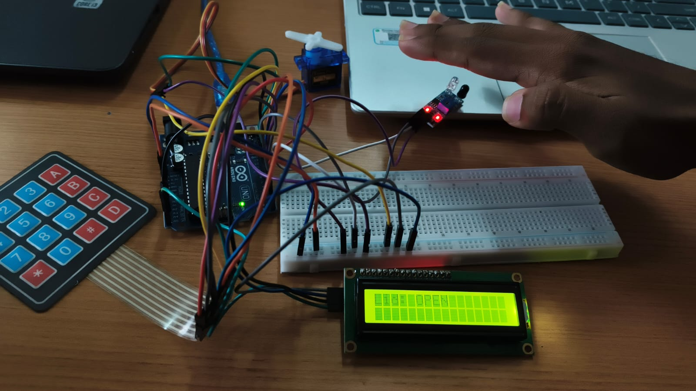
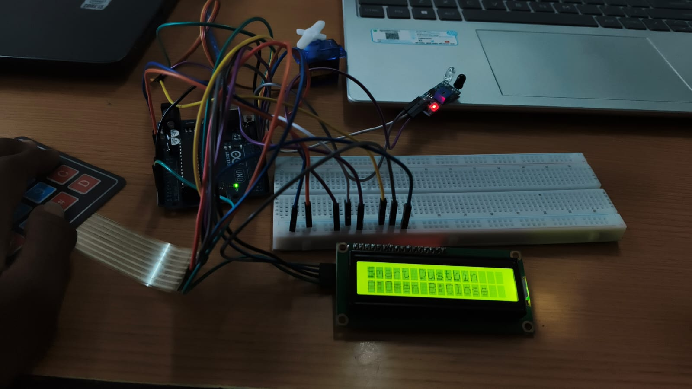
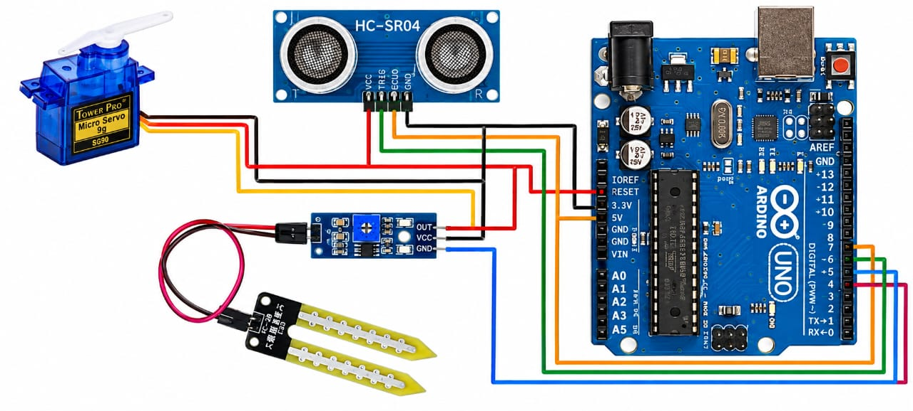

# Smart Dustbin - Stage 1: IR Sensor + Keypad

This is the initial development stage of a Smart Dustbin project built on
an **Arduino Uno**. At this stage, the system uses an **IR obstacle
sensor** for object detection and a **4x4 membrane keypad** for manual
control. Automated lid control, status display, and remote control are
not part of this stage — they are planned for later stages of the
project.

## Components Used

| Component            | Quantity |
|-----------------------|----------|
| Arduino Uno            | 1        |
| IR obstacle sensor module | 1     |
| 4x4 membrane keypad     | 1        |
| Breadboard              | 1        |
| Jumper wires            | As needed |

## How It Works

- The **IR obstacle sensor** continuously monitors the area in front of
  the dustbin. When an object (such as a hand or waste item) comes within
  its detection range, the sensor's output pin changes state, which the
  Arduino reads to trigger an action.
- The **4x4 keypad** provides an alternative, manual input method — a
  key press can be read by the Arduino independently of the IR sensor,
  allowing direct control without relying on object detection.
- Both inputs are read independently by the Arduino: the IR sensor check
  and the keypad scan run in the same loop, so either one can trigger
  behavior on its own.

## Circuit Setup

> **Note:** These photos show the full breadboard workspace used across
> the project (a servo motor and LCD are visible in-frame), but only the
> **IR sensor** and **keypad** wiring described below is relevant to this
> Stage 1 prototype. The servo and LCD are not used or wired for any
> functionality at this stage.

## Pin Connections

| Component        | Pin      | Arduino Uno Pin |
|-------------------|----------|------------------|
| IR sensor          | OUT      | Pin 2            |
| IR sensor          | VCC      | 5V               |
| IR sensor          | GND      | GND              |
| Keypad              | Rows     | Pins 3, 4, 5, 6  |
| Keypad              | Columns  | Pins 7, 8, 10, 11 |

## Next Steps

This is **Stage 1** of the Smart Dustbin project. Planned future stages
include:

- Adding a **servo motor** for automated lid control
- Adding an **LCD display** for status messages
- Adding **Bluetooth connectivity** with a companion **Android app** for
  remote control

## Circuit Schematic

| Component | Pin | Arduino Connection |
|---|---|---|
| Servo motor | Signal | Pin 9 |
| Servo motor | VCC | 5V |
| Servo motor | GND | GND |
| HC-SR04 Ultrasonic (Bin 1 / Wet) | Trig | A0 |
| HC-SR04 Ultrasonic (Bin 1 / Wet) | Echo | A1 |
| HC-SR04 Ultrasonic (Bin 1 / Wet) | VCC | 5V |
| HC-SR04 Ultrasonic (Bin 1 / Wet) | GND | GND |
| HC-SR04 Ultrasonic (Bin 2 / Dry) | Trig | Pin 5 |
| HC-SR04 Ultrasonic (Bin 2 / Dry) | Echo | Pin 6 |
| Soil Moisture Sensor | AO (analog out) | A2 |
| Soil Moisture Sensor | VCC | 5V |
| Soil Moisture Sensor | GND | GND |
| IR Sensor (tray) | OUT | Pin 2 |
| IR Sensor (litter) | OUT | Pin 3 |
| Buzzer | + | Pin 4 |
| LCD (I2C) | SDA / SCL | A4 / A5 |
| HC-05 Bluetooth | TXD / RXD | Pin 12 / Pin 13 |

This schematic illustrates the core sensor wiring (servo, ultrasonic,
moisture sensor). See the pin table above for the complete connection
list including components not pictured (IR sensors, buzzer, LCD,
Bluetooth).

## Author

**Harsha Vardhan** — ECE student, VCET

## License

Open for educational use.
